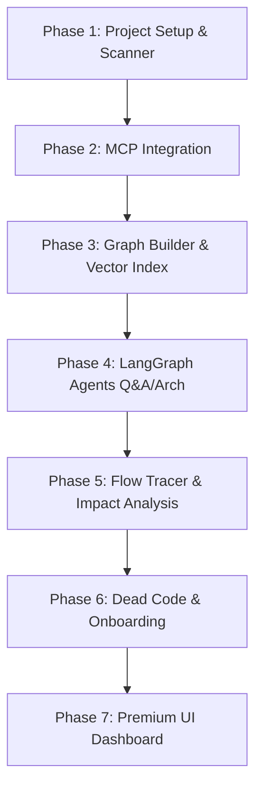

# Implementation Plan - Code Detective

Code Detective is a visual codebase intelligence tool designed to help developers navigate, understand, and analyze large repositories. It parses codebases into abstract syntax trees (ASTs), constructs dependency and knowledge graphs, creates vector embeddings for semantic search, and runs multi-agent LangGraph workflows to answer queries, trace feature flows, analyze impact, detect dead code, and onboard new developers.

## User Review Required

> [!IMPORTANT]
> **Primary Technology Stack Decisions:**
> - **Backend:** Python + FastAPI using a `.env` file containing the `GEMINI_API_KEY`.
> - **Frontend:** Vite + React + Vanilla CSS (Premium Dark Mode, Glassmorphic UI, Mermaid.js, Interactive Graph).
> - **Supported Languages:** Initially, Python (`.py`) and JavaScript/TypeScript (`.js`, `.jsx`, `.ts`, `.tsx`).

## Open Questions

> [!NOTE]
> **What repository are we scanning initially?**
> To test the pipeline end-to-end, we propose:
> 1. Creating a small `/mock-repo` containing a sample Python/React codebase inside our workspace to verify AST parsing, dependency graphs, and flow tracing.
> 2. Setting up a `/cloned-repos` directory where repositories cloned via the **GitHub MCP** will reside. The scanner will target folders in this directory or any absolute path input by the user.

---

## Proposed Changes

We will construct a monorepo setup within the workspace `c:\Users\Shloka Pol\OneDrive\Desktop\code-Detective(p)`:
- `/backend`: Python service containing scanners, parsers, FAISS indexes, MCP tools, and LangGraph agents.
- `/frontend`: Vite + React web interface with premium dark-themed styling, interactive diagrams, and live agent chat.
- `/mock-repo`: A mini codebase containing sample code to verify our system end-to-end.

### Backend Infrastructure (FastAPI + MCP Layer)

#### [NEW] [requirements.txt](file:///c:/Users/Shloka%20Pol/OneDrive/Desktop/code-Detective(p)/backend/requirements.txt)
Python dependencies including `fastapi`, `uvicorn`, `networkx`, `faiss-cpu`, `langgraph`, `google-generativeai`, `pydantic`, `python-dotenv`, and Git/MCP communication libraries.

#### [NEW] [.env](file:///c:/Users/Shloka%20Pol/OneDrive/Desktop/code-Detective(p)/backend/.env)
Local environment configurations:
```env
GEMINI_API_KEY=your_gemini_api_key_here
PORT=8000
```

#### [NEW] [main.py](file:///c:/Users/Shloka%20Pol/OneDrive/Desktop/code-Detective(p)/backend/main.py)
Entrypoint for the FastAPI backend, configuring CORS, routing, and loading MCP plugins.

#### [NEW] [mcp_layer.py](file:///c:/Users/Shloka%20Pol/OneDrive/Desktop/code-Detective(p)/backend/utils/mcp_layer.py)
Orchestrates connections to the model plugins:
- **GitHub MCP:** Clones repositories from a GitHub URL and feeds the local path to the Repository Scanner.
- **Filesystem MCP:** Provides safe read/write interfaces to read specific files (e.g. `auth.py`, `middleware.py`) and return content to agents.
- **Code Search MCP:** Performs keyword/pattern searches across files to find definitions (e.g., where JWT validation is used) instead of loading full source sets.
- **Terminal MCP:** (Optional/Later) Integrates CLI tasks such as running tests or lint commands.

#### [NEW] [scanner.py](file:///c:/Users/Shloka%20Pol/OneDrive/Desktop/code-Detective(p)/backend/utils/scanner.py)
Recursively scans local workspace directories, ignoring `.gitignore` paths, and yields file lists with metadata.

#### [NEW] [parser.py](file:///c:/Users/Shloka%20Pol/OneDrive/Desktop/code-Detective(p)/backend/utils/parser.py)
Utilizes the Python standard `ast` package and a lightweight AST parser for JavaScript/TypeScript imports, exports, functions, class definitions, and calls.

#### [NEW] [graph_builder.py](file:///c:/Users/Shloka%20Pol/OneDrive/Desktop/code-Detective(p)/backend/utils/graph_builder.py)
Builds a code dependency graph using `networkx`. Links files based on imports/exports, function references, and route linkages.

#### [NEW] [vector_index.py](file:///c:/Users/Shloka%20Pol/OneDrive/Desktop/code-Detective(p)/backend/utils/vector_index.py)
Chunks codebase files, runs embeddings via Gemini embedding models, and indexes them in a local FAISS index for semantic chunk retrieval.

#### [NEW] [agents.py](file:///c:/Users/Shloka%20Pol/OneDrive/Desktop/code-Detective(p)/backend/utils/agents.py)
LangGraph-based agents:
- **Repository Q&A Agent:** Coordinates filesystem search, file reading, and contextual answer compilation.
- **Architecture Agent:** Interprets dependency maps and outputs structured Mermaid.js schemas.
- **Impact Analysis Agent:** Performs graph traversal algorithms on code changes to report risk scores and cascade files.
- **Onboarding Mode Agent:** Identifies main modules and outlines sequential learning tracks.

### Frontend Dashboard (Vite + React)

#### [NEW] [package.json](file:///c:/Users/Shloka%20Pol/OneDrive/Desktop/code-Detective(p)/frontend/package.json)
Frontend node project definition. Includes `mermaid`, `lucide-react`, and styling configurations.

#### [NEW] [index.css](file:///c:/Users/Shloka%20Pol/OneDrive/Desktop/code-Detective(p)/frontend/src/index.css)
Global typography, smooth transition animations, and dark glassmorphic UI color tokens (tailored HSL variables).

---

## Phase-Wise Implementation Roadmap



### Phase 1: Setup & Code Parser (Backend Foundation)
- Setup workspace structure `/backend`, `/frontend`, and `/mock-repo`.
- Build the directory scanner module supporting `.gitignore` rules.
- Write the AST parser for Python code definitions (classes, functions, calls, imports) and JavaScript imports/declarations.
- Expose initial API endpoints for local repository loading.

### Phase 2: MCP Integration Layer
- Integrate **GitHub MCP** to handle `https://github.com/org/repo` queries by cloning into `/cloned-repos` and returning local paths to the scanner.
- Integrate **Filesystem MCP** for targeted, permissioned read access of code context.
- Integrate **Code Search MCP** to perform regex and query search across files, enabling efficient text/symbol locating.

### Phase 3: Graph Builder & Vector Index
- Use `networkx` to build and serialize a directed dependency graph.
- Configure local vector store using `faiss-cpu`.
- Embed files using Gemini embedding API (by chunking files into logical sections: class bodies, methods).
- Build semantic code search tools for retrieval by agents.

### Phase 4: LangGraph Agent Integrations (Q&A & Architecture)
- Define base LangGraph schemas.
- Implement Q&A Agent with file search, code read, and context lookup tools.
- Implement Architecture Agent to transform graph clusters and schemas into Mermaid.js format dynamically.

### Phase 5: Feature Flow Tracer & Impact Analysis Agent
- Build custom tracer resolving API routes (`@app.get()`, `app.post()`, Express routes) down to controller methods, services, and queries.
- Build Impact Analysis tools using `networkx` ancestral queries (determining what nodes depend on a changed file). Use Gemini to analyze potential semantic breaks and evaluate risk levels.

### Phase 6: Dead Code Detection & Onboarding Guide
- Write static checkers finding zero-in-degree nodes (unused exports or orphaned utility functions).
- Write Onboarding Agent to synthesize high-level codebase structure into markdown tutorials, detailing timelines and key modules.

### Phase 7: Front-end UI Dashboard & Integration
- Scaffold Vite React project and implement index.css rules (modern typography, gradient borders, active focus transitions).
- Integrate all 6 backend services via simple fetch endpoints.
- Package local visual representations and embed Mermaid.js interactive containers.

---

## Verification Plan

### Automated Tests
- Run test suites for parsing accuracy (`pytest backend/tests/`).
- Verify graph traversal functions for correctness against mock folders.

### Manual Verification
- Launch the FastAPI local server (`uvicorn main:app --reload`).
- Launch Vite developer server (`npm run dev`).
- Load standard target repositories (e.g. a sample Python/React project) and verify each tab returns accurate visual data.
- Validate beautiful visual aesthetics (responsiveness, transitions, error overlays).
